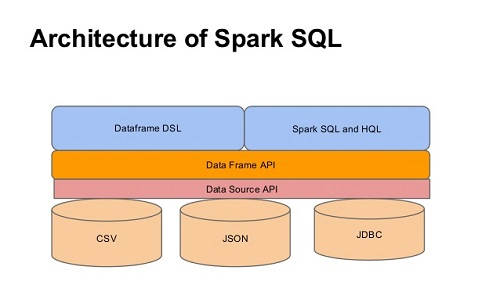
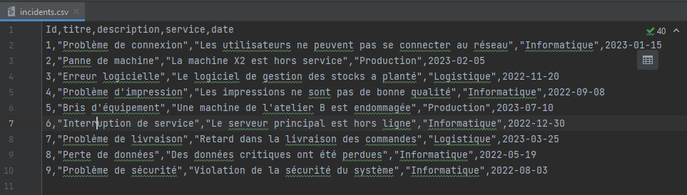
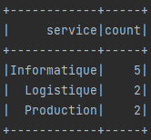
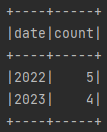
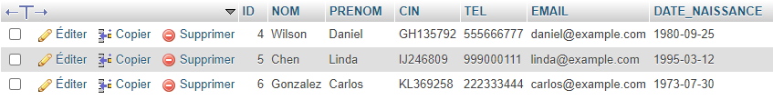
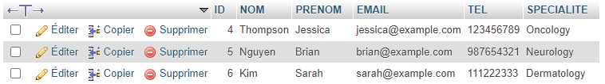
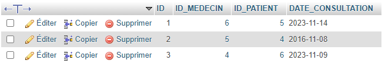
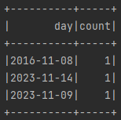
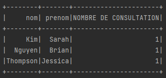

# Big Data Spark SQL


```
Ce projet comprend une explication brève mais informative et simple d'Apache Spark et Termes 
Spark SQL avec implémentation Java. Il y a peu d'exemples structurés à clarifier le concept 
et les termes d'Apache Spark et de Spark SQL.
```

## Table des matières
1. [Overview](#overview)
2. [Prerequisites](#prerequisites)
3. [Applications](#applications)
    * [Incidents SQL](#incidents-sql)
    * [Hopital Database](#hopital-database)


## Overview

### Spark SQL

Spark SQL est un module Spark pour le traitement de données structurées. Contrairement à l'API Spark RDD de base, les interfaces fournies par Spark SQL fournissent à Spark plus d'informations sur la structure des données et sur le calcul effectué. En interne, Spark SQL utilise ces informations supplémentaires pour effectuer des optimisations supplémentaires.




## Prerequisites

* Spark SQL

Ajoutez ces dépendances Maven au fichier pom.xml:

  ```maven
       <dependency>
           <groupId>org.apache.spark</groupId>
           <artifactId>spark-core_2.13</artifactId>
           <version>3.4.1</version>
       </dependency>
       <dependency>
           <groupId>org.apache.spark</groupId>
           <artifactId>spark-sql_2.13</artifactId>
           <version>3.4.1</version>
       </dependency>
       <dependency>
         <groupId>mysql</groupId>
         <artifactId>mysql-connector-java</artifactId>
         <version>8.0.28</version>
     </dependency>
  ```

* Java

## Applications

### Incidents SQL
Nous souhaitons développer une application Spark pour une entreprise industrielle qui traite les incidents de chaque service.

Les incidents sont stockés dans un fichier CSV.



```java
SparkSession ss = SparkSession.builder().appName("IncidentsAppSparkSql").master("local[*]").getOrCreate();
Dataset<Row> incidentsDF = ss.read().option("header",true).option("inferSchema",true).csv("incidents.csv");
```

* Afficher le nombre d'incidents par service.

```java
incidentsDF.groupBy("service").count().show();
```



* Affichez les deux années avec le plus d'incidents.

```java
incidentsDF = incidentsDF.withColumn("date", year(col("date")));
incidentsDF.groupBy("date").count().orderBy(desc("count")).show(2);
```



### Hopital Database

Créez une base de données MySQL nommée DB_HOPITAL, qui contient trois tables

* PATIENTS :



* MEDECINS :



* CONSULTATIONS :



* Accédez aux données de la base de données :

```java
        SparkSession ss = SparkSession.builder().appName("HopitalAppSparkSQL").master("local[*]").getOrCreate();

        Map<String, String> option = new HashMap<>();
        option.put("driver", "com.mysql.jdbc.Driver");
        option.put("url", "jdbc:mysql://localhost:3306/db_hopital");
        option.put("user","root");
        option.put("password","");

        Dataset<Row> df1 = ss.read().format("jdbc")
                .options(option)
                //.option("table","table_name")
                .option("query","select * from consultations")
                .load();
        Dataset<Row> df2 = ss.read().format("jdbc")
                .options(option)
                .option("query","select * from medecins")
                .load();
```

* Afficher le nombre de consultations par jour :

```java
df1.groupBy(col("DATE_CONSULTATION").alias("day")).count().show();
```



* Afficher le nombre de consultations par médecin. Le format d'affichage est le suivant :

`nom | prenom | nombre de consultation`

```java
        Dataset<Row> dfConsultations = df1.groupBy(col("id_medecin")).count();
        Dataset<Row> dfMedicins = df2.select("id","nom","prenom");

        Dataset<Row> joinedDF = dfMedicins
                .join(dfConsultations, dfMedicins.col("id").equalTo(dfConsultations.col("id_medecin")), "inner")
                .select(dfMedicins.col("nom"), dfMedicins.col("prenom"),
                 dfConsultations.col("count").alias("NOMBRE DE CONSULTATION"))
                .orderBy(col("NOMBRE DE CONSULTATION").desc());

        joinedDF.show();
```

